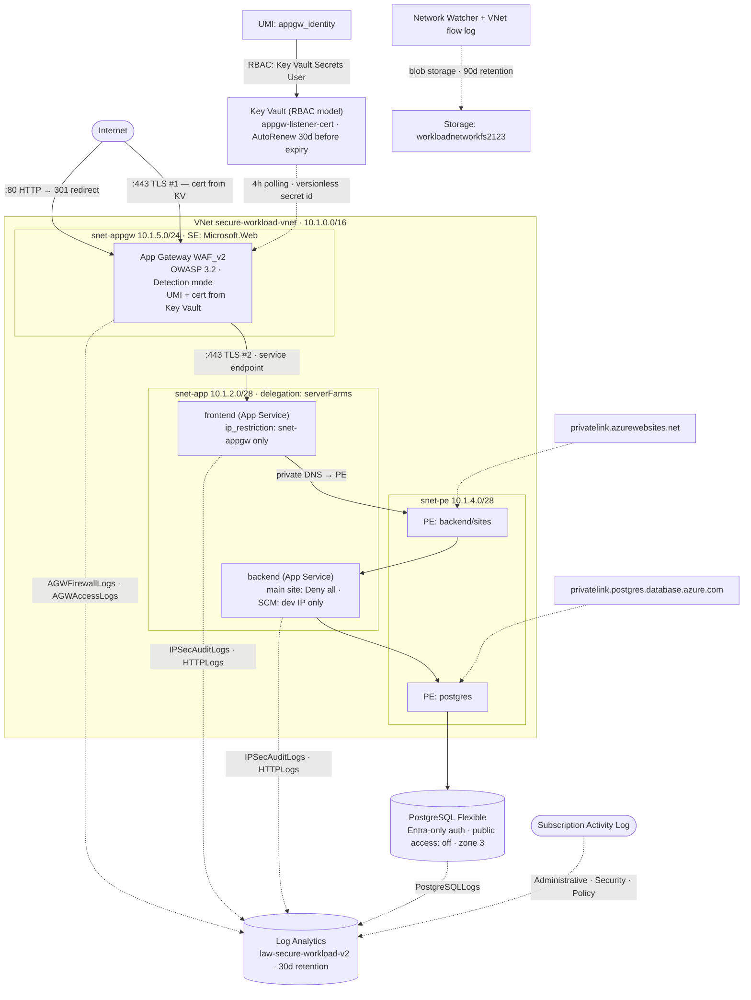

# azure-secure-workload

I work in security operations and know Azure from the detection side: log sources, queries, alerts (Mostly Defender/Sentinel stack). This project is where I built the other half. The infrastructure itself, in Terraform, so that I could see both ends of the same system.

The organizing idea is that a control which cannot be observed cannot be trusted. Every hardening decision here is paired with the signal it produces when something interacts with it, and the queries that read those signals are in the repository next to the code that creates them.

## Architecture


A single Azure workload: an Application Gateway with WAF in front, two Linux App Services behind it, a PostgreSQL Flexible Server reachable only through a private endpoint, and a Key Vault holding the TLS certificate. Everything is deployed from Terraform through GitHub Actions. Region is swedencentral.

The design decisions are in [`adr/`](adr/)


## What is actually hardened

| Control | Enforced by | Signal when exercised |
|---|---|---|
| Public ingress only through WAF | App Service `ip_restriction` default Deny, allow App Gateway subnet | `AppServiceIPSecAuditLogs` |
| Deployment endpoint restricted to one IP | `scm_ip_restriction` default Deny | `AppServiceIPSecAuditLogs` |
| No password authentication to the database | `password_auth_enabled = false`, Entra-only | `PGSQLServerLogs` |
| Database not reachable from the internet | Private endpoint, private DNS, public access disabled | `PGSQLServerLogs`, connection source |
| Attack traffic filtered at the edge | Application Gateway WAF policy | `AGWFirewallLogs`, `AGWAccessLogs` |
| No stored credentials in CI/CD | OIDC federation to a user-assigned managed identity | `AzureActivity` |
| Pipeline cannot escalate its own privileges | RBAC Administrator with a condition limiting grantable roles | `AzureActivity` |

## Detections

Three KQL queries in [`detections/`](detections/), each with its hypothesis, the baseline I measured, known false positives, and what to do when it fires.

- `scm-denied-from-unknown-ip.kql` — the deployment endpoint is restricted to one address, so a denied request to it is someone probing. Baseline was zero over 30 days. Validated by triggering it from a mobile network.
- `pgsql-auth-anomaly.kql` — 17558 connection events measured, all of them certificate-authenticated from the local platform. Any other authentication method, any non-LOG level, or any non-platform source is an anomaly by construction rather than by statistics.
- `waf-suspicious-traffic-reaching-backend.kql` — the gateway is scanned continuously, so volume is weather. The query alerts on requests that tripped multiple WAF rule categories and were still served. The threshold comes from the measured distribution of distinct rules per source, not from a guess.

The queries were calibrated against real internet traffic. The seven-day sample contained a CVE-2012-1823 PHP-CGI campaign from eight rotating addresses, a secrets harvester walking `.env` and `.docker/config.json` paths, and framework-specific probing.

## Pipeline

Two workflows in [`.github/workflows/`](.github/workflows/):

- `pr-checks.yml` runs on pull requests: format, init, validate, plan, and a Checkov scan.
- `apply.yml` runs on merge to main and applies the plan it just produced.

Authentication is OIDC workload identity federation with no secret stored anywhere. GitHub issues a short-lived token describing the execution context, Entra ID verifies the signature and matches the subject claim, and Terraform exchanges it for an Azure token. Two federated credentials map to two trust levels on the same identity: pull requests can plan, only the main branch can apply.

The identity, its role assignments and the state storage live outside the state they operate on, created by [`scripts/bootstrap.sh`](scripts/bootstrap.sh). That script is also the recovery procedure: rebuilding the whole bootstrap layer after a tenant reset is one command.

## Compliance scanning

Checkov runs on every pull request. The first scan returned 36 failures. I sorted them into three groups rather than fixing or ignoring everything: cheap fixes aligned with the goal of the project, accepted risks documented as inline `#checkov:skip` annotations with the reason next to the resource, and real findings that need an experiment or a decision, which stay failing as a visible backlog.

Current state: 58 passed, 20 skipped with a written rationale, 6 open. The open ones are in [`BACKLOG.md`](BACKLOG.md) with what would close them.

## Scope and current state

This is a lab, and some of the choices reflect that. Single environment, no zone redundancy, locally redundant storage, purge protection off on the Key Vault so the name can be reused after teardowns. Where a production answer would differ, the ADR says so.

Nothing here is finished in the sense of being production ready. It is finished in the sense that every piece of it has a reason I can explain.

## Repository layout

```
.github/workflows/   pipeline definitions
adr/                 architecture decision records
detections/          KQL queries with hypotheses and baselines
scripts/             bootstrap layer, outside Terraform state
secure-workload/     the Terraform configuration
BACKLOG.md           open items with what closes them
```

## Running it

The bootstrap script creates the identity, permissions and state storage. After that, the pipeline is the only path to a deployment.

```bash
az login
./scripts/bootstrap.sh
```

The script prints the follow-up steps it cannot do for you: the state storage account name for the backend block, the Entra administrator values for PostgreSQL, and the developer IP.

## Project workflow

Pull requests are squash-merged, so the history on main reads as one entry per unit of work. Terraform formatting and secret scanning run as pre-commit hooks locally and again in CI, since a local hook can be skipped and a pipeline check cannot.